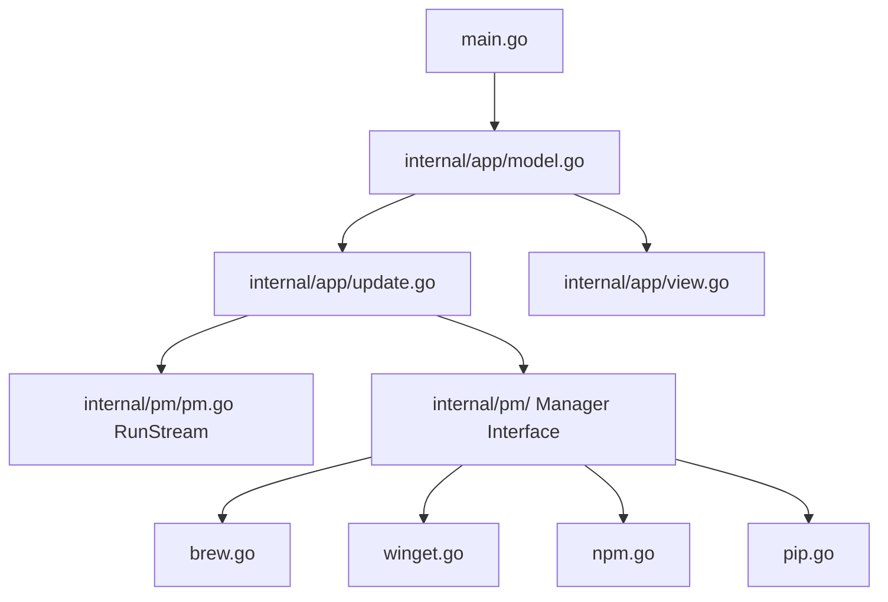

# Architecture System Design

`devpkgs` is a high-performance terminal dashboard for managing developer packages across multiple package managers (Homebrew, WinGet, NPM, Pip). It is built entirely in Go using the **Bubble Tea** (Elm Architecture) framework and styled with **Lipgloss**.

---

## Component Architecture



### 1. App Shell & State Engine (`internal/app`)
* **Model (`model.go`)**: Houses the application state, active tab metadata, filter queries, selection maps (for bulk multi-select), overlay panel states (modals for actions, logs, themes), and the rolling braille sparkline history.
* **Update loop (`update.go`)**: Processes user keystrokes (navigation, search filters, space multi-select, actions confirmation) and translates package manager events (stream log lines, list loads, action finishes) into state changes.
* **Layout Engine (`view.go`, `panels.go`, `tabs.go`)**: Translates current states into lipgloss-styled terminal layout sections (Header, Tabs, Search Bar, Left/Right Panels, overlays, and Footer).

### 2. Package Managers (`internal/pm`)
All package managers implement a common, asynchronous `Manager` interface:

```go
type Manager interface {
	Name() string
	TabLabel() string
	ListInstalled() tea.Cmd
	RunAction(name string, action Action, programChan chan<- tea.Msg) tea.Cmd
}
```

* **Homebrew (`brew.go`)**: Lists installed formulas. Sizing is computed natively in Go (`filepath.WalkDir`). Package descriptions are parsed offline locally (`brew info --json`). Online registry searches are lazy-loaded on-demand on the first query.
* **WinGet (`winget.go`)**: Streams and parses the output of `winget list` directly into memory for instant startup listing.
* **NPM (`npm.go`)**: Parses globally installed npm packages and queries the public npm registry for details.
* **Pip (`pip.go`)**: Parses local pip packages using `pip list --format=json` and queries PyPI metadata APIs.

### 3. Action Execution Engine (`internal/pm/pm.go`)
* **Asynchronous Streaming**: The `RunStream` execution helper spawns the package manager subprocess and streams its `stdout`/`stderr` output line-by-line using Go channels back to the Bubble Tea update loop, enabling real-time scrollable logging inside the UI modal.
* **Sequential Bulk Executor**: The app supports selecting multiple packages on a tab (using `Space`) and executing bulk upgrades/removals sequentially. The state machine loops through the queue, logs stdout for each package with visual delimiters, and tracks errors.

---

## Data Flows

### Startup Sequence
1. `main.go` runs `app.New()` and calls `Init()`.
2. `Init()` triggers `ListInstalled()` command batches for all 4 package managers.
3. Package managers extract installed packages and versions (fully offline & locally).
4. The loader screen updates progress and fades once all lists are resolved.

### Action Run Flow (e.g. Install / Remove / Upgrade)
1. User highlights a package and triggers action (e.g., `i` for install, `x` for remove).
2. Action overlay prompts for confirmation.
3. On confirmation, `RunAction()` spawns the process, pipes the output to `LogLineMsg` channel.
4. TUI updates logs modal with live streaming stdout.
5. On process completion, `ActionMsg` is sent, triggering a local tab refresh.
